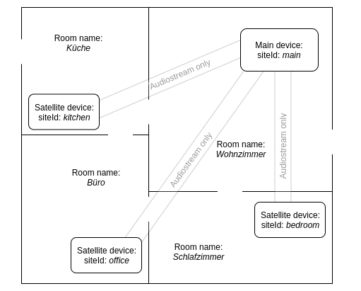

# Snips-Wecker :alarm_clock:
An app for [Snips.ai](https://snips.ai/) with a fully controllable alarm clock.

##### Table of Contents  
[Features](#i-features)  
[Installation](#ii-installation)  
[Configuration](#iii-configuration)  
[Usage](#iv-usage)  
[Troubleshooting](#v-troubleshooting)  
[Coming soon](#vi-coming-soon)  
[Contribution](#vii-contribution)  


## I. Features

- Full multi-room support :house:
- context-awareness: it detects what room you're in :speech_balloon:
- customizable (ringtone sound, volume, ringing timeout, rooms) :wrench:


## II. Installation

:exclamation: The following instructions assume that [Snips](https://snips.gitbook.io/documentation/snips-basics) is
already configured and running on your device (e.g. a Raspberry Pi 3 from the 
[Snips Maker Kit](https://makers.snips.ai/kit/) with 
[Raspbian](https://www.raspberrypi.org/downloads/raspbian/) Stretch Lite). 
[SAM](https://snips.gitbook.io/getting-started/installation) should
also already be set up and connected to your device and your account.

1. In the German [app store](https://console.snips.ai/) add the
app `Wecker & Alarme` (by domi; [this](https://console.snips.ai/store/de/skill_61Vz8lVkXQbM)) to
your *German* assistant.

2. You want to have a more unique alarmclock? Take a look at the section [Configuration](#iii-configuration) below and
see what you can change.

3. In the console scroll down to the parameters section.

    

    Now you may change some parameter values of the alarmclock.
    
4. If you already have the same assistant on your platform, update it with:
      ```bash
      sam update-assistant
      ```
      
   Otherwise install the assistant on the platform with the following command to
   choose it (if you have multiple assistants in your Snips console):
      ```bash
      sam install assistant
      ```
    
## III. Configuration

### 1. Normal (single-room specific)

In the Snips console or manually in the file `/var/lib/snips/skills/Snips-Wecker/config.ini` you can change
some parameters that influence the behaviour of the alarm clock app:

| Parameter name  | Default | Range   | Description                                                                    |
|-----------------|---------|---------|--------------------------------------------------------------------------------|
| ringing_volume  | 50      | 0 - 100 | Volume of the ringtone                                                         |
| ringing_timeout | 30     | 3 - 8000| Time in seconds for the ringing timeout                                        |
| restore_alarms  | on      | on/off  | Whether the alarms should be restored after reboot                             |
| ringtone_status | on      | on/off  | Describes the state of the ringtone. If it's off, only a MQTT message will be sent when the alarm is ringing |

### 2. Advanced (multi-room specific)

- **Parameter** `ringing_volume` for different ringing volume in each room:<br/>

  Scheme: ```siteId1: volume1, siteId2: volume2, siteId3: volume3, [...]``` <br/> 
  Unit: Volume in _%_ with range 0 - 100
  
  Example: ```kitchen: 20, bedroom: 70, bathroom: 100```
  
- **Parameter** `ringing_timeout` for different ringing timeout in each room:<br/>
  
  Scheme: ```siteId1: timeout1, siteId2: timeout2, siteId3: timeout3, [...]``` <br/> 
  Unit: Timeout in _seconds_ with range 3 to 8000
  
  Example: ```kitchen: 50, bedroom: 120, bathroom: 300```

- **Parameter** `ringtone_status` for different ringtone status in each room:<br/>
  
  Scheme: ```siteId1: status1, siteId2: status2, siteId3: status3, [...]``` <br/> 
  Unit: Status with _on_ or _off_
  
  Example: ```kitchen: off, bedroom: on, bathroom: on```

- **Parameter** `dict_siteIds`:<br/>
  Important if you have a multi-room setup of Snips! These are pairs of room names and siteIds of these rooms.
  
  Scheme: ```room1: siteId1, room2: siteId2, room3: siteId3, [...]```<br/>
  Default: `Schlafzimmer:default`

- **Parameter** `default_room`:<br/>
  Important if you have a multi-room setup of Snips!<br/>
  Here must be the name of the room in which the alarm is to be set, if no room was said in the command.
  
  Scheme: ```roomname```<br/>
  Default: `Schlafzimmer`

#### Examples of multi-room configurations

##### Example 1



Parameters values in the [Snips console](https://console.snips.ai/) in this app:

- dict_site-id: `Wohnzimmer:main, Küche:kitchen, Büro:office, Schlafzimmer:bedroom`
- default_room: `Schlafzimmer`

## IV. Usage

### 1. Example sentences

**New alarm:**

- *Wecke mich `in neun Stunden`.*
- *Kannst du mich `morgen um 8 Uhr 30` wecken?*
- *Bitte wecke mich `in drei Tagen um 5 Uhr`.*
- *Stelle einen Alarm `in zwei Minuten`.*
- *Alarmiere mich `hier` `in 15 Minuten`.*
- *Stelle im `Schlafzimmer` einen Alarm auf `10 Uhr 20`.*
- *Stelle einen Alarm in der `Küche` auf `18 Uhr 50`.*
- *Ich möchte `morgen um 7 Uhr` in `diesem Raum` geweckt werden.*
- *`Morgen` soll mich ein Wecker `um 10 Uhr` wecken.*

**Get alarms:**

- *Gibt es einen Alarm `um 12 Uhr`?*
- *Gibt es einen Wecker `um 1 Uhr` in `diesem Zimmer`?*
- *Sage alle Alarme `hier` `zwischen 21 Uhr und 23 Uhr`.*
- *Bitte zähle die Alarme von der `Küche` `bis zwanzig Uhr` auf.*
- *Wird `heute um Mitternacht` der Wecker im `Kinderzimmer` losgehen?*
- *Ist für `heute Abend neunzehn Uhr` ein Wecker aktiv?*
- *Ich will alle Alarme wissen, die `heute` in `diesem Zimmer` klingeln.*
- *Welche Alarme werden `am Mittwoch in zwei Wochen` klingeln?*

**Get next alarm:**

- *Wann klingelt in der `Küche` der nächste Alarm?*
- *Was ist der nächste Alarm?*
- *Kannst du mir sagen wann der nächste Alarm klingelt?*
- *In wie vielen Stunden klingelt `hier` der nächste Alarm?*
- *Sage mir wann der nächste Alarm klingelt.*
- *Wann ist der nächste Wecker gestellt?*
- *Wann klingelt der nächste Alarm im `Bad`?*
- *Ich will wissen wann im `Schlafzimmer` der nächste Alarm los geht.*

**Delete alarms:**

- *Lösche alle Alarme `morgen um neun Uhr` im `Foyer`.*
- *Kannst du bitte den Wecker `morgen um neun Uhr` im `Foyer` entfernen.*
- *Kannst du den Wecker `in zwei Tagen um achtzehn Uhr` im `Eingangsbereich` löschen.*
- *Alarm `um neun Uhr zehn` im `Esszimmer` löschen.*
- *Bitte den Alarm im `Wohnzimmer` `um 8 Uhr zwanzig` entfernen.*
- *Entferne den Alarm `heute um zehn Uhr` auf dem `Dachboden`.*
- *Lösche den Alarm `heute um drei Uhr` in `diesem Raum`.*
- *Entferne den Wecker im `Klo` `um acht Uhr`.*

**Get missed alarms:**

- *Habe ich Alarme `heute` `hier` verpasst?*
- *Habe ich in der Vergangenheit `hier` Alarme verpasst?*
- *Sage bitte die nicht gehörten Wecker vom `Eingang`.*
- *Kannst du die nicht gehörten Alarme sagen.*
- *Bitte lese alle verpassten Alarme von `gestern` vor.*
- *Kannst du alle verpassten Wecker von der `Küche` sagen.*
- *Sage alle verpassten Alarme von `diesem Mittwoch`.*
- *Habe ich `letzte Woche` im `Kinderzimmer` einen Alarm verpasst?*


### 2. While ringing

While an alarm is ringing in a room you can say a hotword in this room, which is by default "Hey Snips!".
The ringtone


## V. Troubleshooting

- I can't receive some MQTT messages from the Alarmclock.

    Some MQTT clients may have a package size limit, so you won be able to receive messages with a larger
    payload than the limit size until you increase this. E.g. in the library `PubSubClient` for the Arduino the package
    limit is 128 bytes. In the file `<Arduino libraries folder>/PubSubClient/src/PubSubClient.h` the constant 
    `MQTT_MAX_PACKET_SIZE` must be increased. How much? This depends on how many alarms you will create.

- The time is wrong on my device.

    Make sure that the time and date are correct on your device.

## VI. Coming :soon:

- Ask for missed alarms [############_]
- New setting: snooze en/disabled (then don't end session)
- Internationalisation [############__]
- Nice README [#######__________]
- Send alarm data over MQTT [###_________________]
- Maybe: periodical alarms (daily, weekly); before: change clock thread to schedule module


## VII. Contribution

Please report errors and bugs (you can see them with `sam service log snips-skill-server` or on the Pi
with `sudo tail -f /var/log/syslog`) by opening
a [new issue](https://github.com/MrJohnZoidberg/Snips-Wecker/issues/new).
You can also write other ideas for this app. Thank you for your contribution.

Made with :blue_heart:
